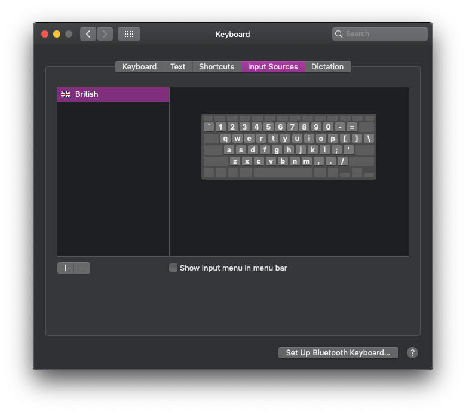
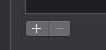
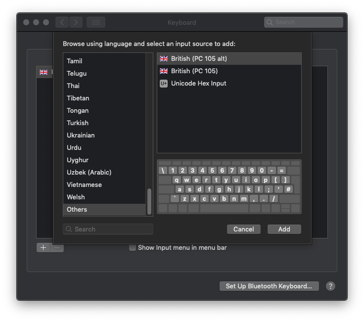
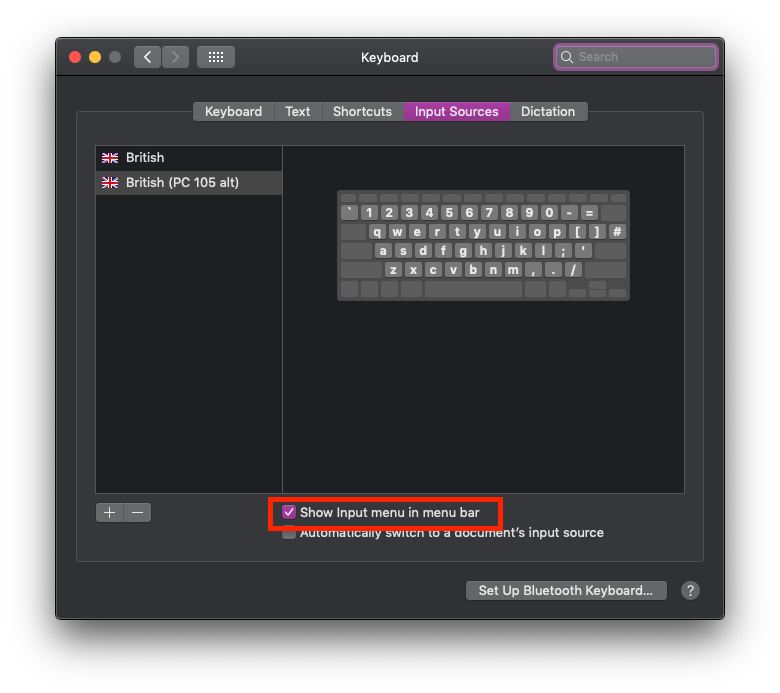
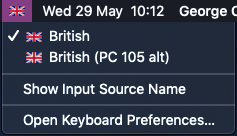

# Mac-Uk-Keyboard-Layouts
A couple of Keyboard layouts for UK (ISO) standard keyboards for when used with a Mac.

## How to use
1. Clone the repository or download the contents of `/layouts` directory. This should be `.icns` and `.keylayout` files.
2. Copy the contents of the `/layouts` directory to `/Library/Keyboard Layouts/`. *(Hint: If going through Finder this will be under the local user' name, use `⌘ + ⇧ + .` to display hidden files)*
3. Open Keyboard Input Sources from System Preferences: ` > System Preferences > Keyboard > Input Sources` 
4. Click the `+` icon in the bottom left to add a new keyboard
   
   
5. Scroll down and select `Others` from the bottom of the list
6. Select the keyboard you would like to use and click `Add` 

## Tips
### Menu Icon
This process will change the layout of the inbuilt keyboard on a MacBook, if you wish to quickly revert back to the standard keyboard then enable `Show Input menu in menu bar` from the `Input Sources` tab. 

This will display an icon to quickly switch between keyboard layouts.

### Key Bindings
- You will loose the `fn` button 
- `⌃` becomes `ctrl`
- `⌘` becomes the Windows key
- `⌥` becomes `alt`

